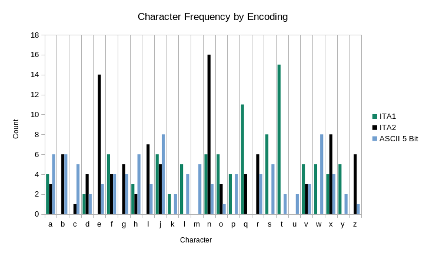

# K4 Notes

## Websites
1) https://kryptos.hoerenberg.com/index.php?cat=Kryptos%20K4&page=Introduction
2) https://numberworld.blogspot.com/2020/07/kryptos-cipher-part-4.html
3) http://www.thekryptosproject.com/kryptos/k0-k5/k4.php
4) https://en.wikipedia.org/wiki/Kryptos#Clues_given_for_passage_4

## Baudot
(1) Talks about using 5-bit ASCII codes and XORing them with some value. This is interesting, but ASCII isn't the only
encoding system. Baudot (aka ITA1 and later ITA2) codes are 5-bit encodings for typewriters. 

The original, ITA1, was used mainly in Europe and because all text in K4 seems to be ASCII complaint, we can focus on
the UK variant of the codes. The bits are the same, however for some of the characters in the Europe variant make
space for [Diacritics](https://en.wikipedia.org/wiki/Diacritic).

ITA2 covers Baudot-Murray codes that have a slightly different bit pattern. This was done to reduce ware
on commonly used characters, e.g. e, t, a, etc.

### Websites
* https://en.wikipedia.org/wiki/Baudot_code

## ASCII
ASCII is also a possible encoding system. While the text by default is 
8 bits, it's also possible to encode them into 5 bits just like 
Baudot codes.

## Baudot + Vigenere

The goal here isn't to solve it (well, that would be nice though). Instead, we want to filter for some known words
to help narrow search spaces. We can do the same thing with `berlin` but we don't get any results.
Expanding this with an extended dictionary of 
[370k words](https://raw.githubusercontent.com/dwyl/english-words/master/words_alpha.txt) doesn't seem to help much
either. 
Maybe it's not a Vigenere? It's likely worth doing some kind of frequency analysis on the `pmap` result to get a 
confidence rating to back that up

```clojure
(ns kryptos.example
  (:require [clojure.string :as string]
            [kryptos.vigenere :as virgnere]
            [kryptos.crack.dictionary :as dictonary]
            [kryptos.encoding.decoder :as decoder]))

(def dict (->> (dictionary/load-word-dictionary)
               (map #'string/lower-case))

  (let [text (decoder/decode-string-with-bit-encoder-as-str k4 ita1)
        key "kryptos"]
    (->> dict
         (pmap #(vigenere/decode text % key))
         (filterv #(clojure.string/includes? % "east"))))
```

Swapping in `ita2` or `5-bit-ascii` as the encoder does produce some interesting results,
but nothing that isn't babble. Additionally, neither produces anything when filtering for
`berlin`, or `northeast`.

## Frequency Analysis of K4 Using Encoders
Using the following code, we can generate a mapping from the encoder
to the frequency map of the characters within the converted string.
```clojure
(->> (for [e ['baudot/ita1 'baudot/ita2 'ascii/ascii-5-bit] 
           :let [encoder-name (name e) 
                 encoder      (eval e) 
                 text         (decoder/decode-string-with-bit-encoder-as-str k4 encoder)]] 
       {encoder-name (frequencies text)})
     (into {}))
```

For the sake of making it easier to read, here is a graph for 
each of the above encoders.


ASCII contains characters for all but `q`, while both Baudot codes
are missing several characters.
